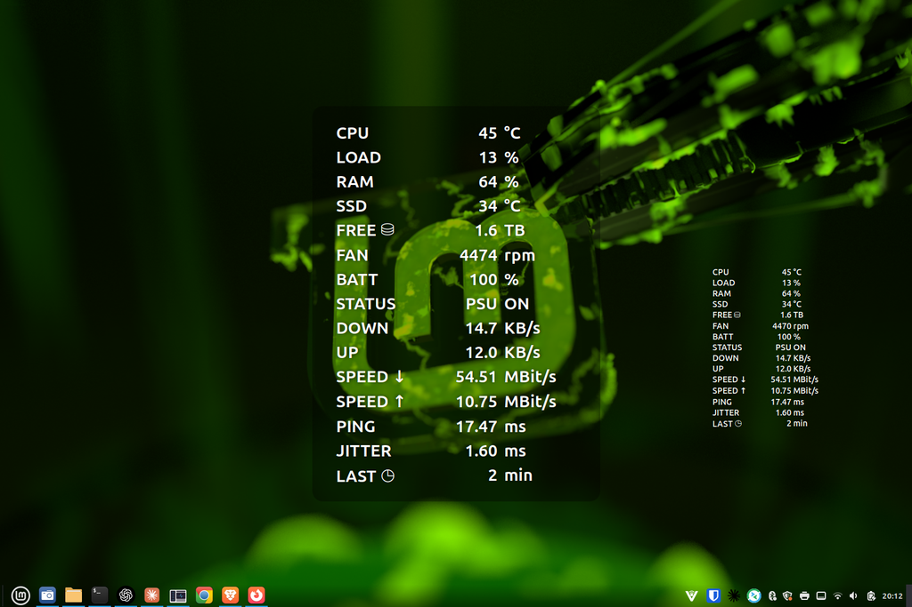
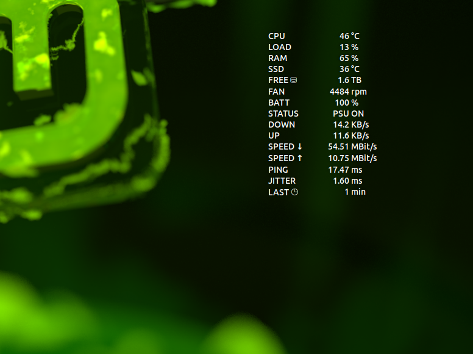
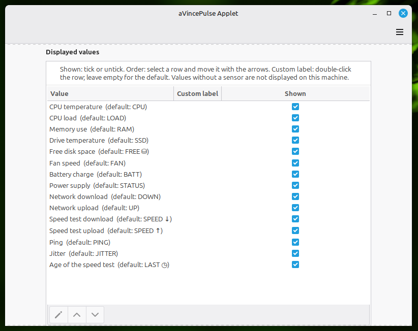

# aVincePulse

**Hardware and network monitor for Linux Mint Cinnamon.**

*[Diese Seite auf Deutsch](README.de.md)*

aVincePulse shows CPU and storage temperature, load, memory, free disk
space, fan speed, battery, live network throughput and internet speed
test results — as a panel applet, as a desktop desklet, or both.

> **Development version.** This is `0.1.0-dev.23`. It works and is used
> daily on the reference machine, but it has so far only been tested on
> that one computer. The user interface is currently available in
> German only; an English translation is the next step. Not yet
> submitted to Cinnamon Spices.

<!-- SCREENSHOT PLACEHOLDER 1: applet with the hover display open   -->
<!-- To be replaced with an image before release:                    -->
<!--  -->

## Two components, each on its own

aVincePulse comes as two separate pieces that follow one principle:
**independent, yet cooperative.**

| | |
|---|---|
| **Applet** | An icon in the Cinnamon panel. Hovering over it with the mouse — or tapping it on a touchscreen — opens a large, easy-to-read display of all values in the centre of the screen. |
| **Desklet** | A permanent display on the desktop. |

Install one or both. Neither needs the other to work: each reads its
own sensors and each can run the speed test. What they do share is the
last speed test result, so a test started in one is visible in the
other.

<!-- SCREENSHOT PLACEHOLDER 2: desklet on the desktop -->
<!--  -->

## What it measures

15 values, each of which can be hidden, renamed and reordered:

| Value | Shown as | Source |
|---|---|---|
| CPU temperature | `CPU` | `/sys/class/hwmon` |
| CPU load | `LOAD` | `/proc/stat` |
| Memory use | `RAM` | `/proc/meminfo` |
| Storage temperature | `SSD` | `/sys/class/hwmon` |
| Free disk space | `FREE ⛁` | chosen filesystem |
| Fan speed | `FAN` | `/sys/class/hwmon` |
| Battery charge | `BATT` | `/sys/class/power_supply` |
| Power supply | `STATUS` | `/sys/class/power_supply` |
| Network download | `DOWN` | chosen interface |
| Network upload | `UP` | chosen interface |
| Speed test download | `SPEED ↓` | speed test program |
| Speed test upload | `SPEED ↑` | speed test program |
| Ping | `PING` | speed test program |
| Jitter | `JITTER` | speed test program |
| Age of last test | `LAST ◷` | stored result |

Values whose sensor does not exist on your machine are simply not
shown. A desktop PC without a battery does not get an empty battery
row, and a missing sensor never causes an error.

## Features

**Sensors found automatically, chosen by hand when you want to.**
aVincePulse scans `/sys/class/hwmon` and picks sensible sensors by
itself. `hwmonN` numbers are not stable across reboots, so each sensor
is identified by chip, device and number instead. If the automatic
choice is wrong, pick another from a list that shows each sensor's
current reading. The same applies to the network interface and the
drive whose free space is shown.

**Hardware can be re-detected** without restarting Cinnamon — useful
after fitting a new drive, or when a driver loaded late.

**Warning colours.** Values turn orange and then red when they cross a
threshold. Thresholds are yours to set:

| Value | Warning | Critical |
|---|---|---|
| CPU temperature | 80 °C | 90 °C |
| Storage temperature | 70 °C | 80 °C |
| CPU load | 85 % | 95 % |
| Memory use | 85 % | 95 % |
| Free disk space | below 10 % | below 5 % |
| Battery charge | below 20 % | below 10 % |

Two colour sets are available — bright for dark wallpapers, muted for
light ones — because the program cannot know what is behind its
display.

**Designed for light and dark backgrounds.** A strong text shadow
improves legibility, and an optional dimmed panel behind the text can
be strengthened or turned off entirely.

**Both components tick together.** The measuring interval is aligned to
the system clock, so with the same interval set, applet and desklet
measure in the same moment without knowing about each other.

**Nothing opens by itself.** aVincePulse never opens or closes a window
without you asking for it, and never shows a notification you did not
request.

## Requirements

- Linux Mint with Cinnamon 6.x — developed and tested against 6.6 on X11
- No root rights, no additional services, no extra packages for the
  monitoring itself

Everything above works out of the box. Only the internet speed test
needs a separate program.

## The internet speed test

The speed test needs one of two command line programs, whichever is
present:

| Program | Notes |
|---|---|
| **librespeed-cli** | Preferred. Measures against the free LibreSpeed servers and is the only one of the two that reports jitter. |
| **speedtest-cli** | Available from the standard Mint and Ubuntu repositories. Does not report jitter, and is less accurate on fast connections. |

If both are installed, you can choose. If only one is, it is used. **If
neither is installed, the speed test button simply disappears** and
everything else keeps working — the speed test is an extra, not a
requirement.

aVincePulse stores only the download, upload and ping values measured
by the program it used, plus jitter where available. It never stores
the IP address, approximate location or provider information the
program reports, neither in the saved values nor in the lasting
reports.

## Installation

Not yet available through Cinnamon Spices. For now, copy the two
directories into place:

```bash
git clone https://github.com/aVince-Industrietechnik/aVincePulse.git
cd aVincePulse
mkdir -p ~/.local/share/cinnamon/applets/avincepulse-applet@avince
mkdir -p ~/.local/share/cinnamon/desklets/avincepulse-desklet@avince
rsync -a --delete 02_QUELLCODE/Applet/  ~/.local/share/cinnamon/applets/avincepulse-applet@avince/
rsync -a --delete 02_QUELLCODE/Desklet/ ~/.local/share/cinnamon/desklets/avincepulse-desklet@avince/
```

The same commands serve as an update: run `git pull`, then run them
again. `rsync` replaces changed files and removes any that no longer
exist. The trailing slashes matter — they copy the *contents* of the
directories rather than the directories themselves. Your settings,
reports and speed test values live elsewhere and are left untouched.

Then restart Cinnamon (`Alt`+`F2`, then `r`, then Enter) and add the
applet or the desklet the usual way, through *System Settings →
Applets* or *Desklets*.

A Wayland session cannot restart Cinnamon this way; log out and back
in instead. aVincePulse has only been tested under X11.

You only need the part you actually want — the applet directory alone
is enough for the applet.

### Removing it

Remove the applet or desklet through System Settings, then delete the
directory you copied.

Cinnamon handles the settings itself: taking the applet off the panel
leaves them in place, while removing the xlet altogether deletes its
settings file as well.

aVincePulse also keeps a few files under
`~/.local/share/avincepulse/` — the last speed test result and the
reports it wrote. Those always remain. Delete that directory if you
want nothing left behind; nothing else on your system is touched.

## Where it stores things

| Path | Contents |
|---|---|
| `~/.config/cinnamon/spices/<uuid>/` | your settings, one file per component |
| `~/.local/share/avincepulse/speedtest-values` | the most recent speed test result |
| `~/.local/share/avincepulse/berichte/Hardware/` | hardware detection reports |
| `~/.local/share/avincepulse/berichte/Speedtest/` | speed test reports |
| `~/.local/share/avincepulse/speedtest.lock` | only while a speed test is running |

aVincePulse writes nothing outside these paths.

Reports are never deleted automatically. aVincePulse does not remove
anything you might want to read.

## Settings

Both components are configured separately, through the normal Cinnamon
settings window, and each has a button to restore every default.

<!-- SCREENSHOT PLACEHOLDER 3: settings window -->
<!--  -->

Among the settings: update interval, display size, font size and
weight, background dimming, the panel icon, what a left click does,
which values are shown and in which order, custom labels, sensor
choice, network interface, drive, warning thresholds and colours, and
the speed test program.

## Support

aVincePulse is free and complete. There is no paid version, no
subscription, and nothing held back behind a payment — every feature
described here is in the version you can download.

If it is useful to you and you would like to support its further
development, you are welcome to do so. It is entirely voluntary and
changes nothing about the program.

**[Support aVincePulse on Ko-fi](https://ko-fi.com/avince)**

There is also a button at the bottom of the settings window. That is
the only place the program mentions it: no pop-ups, no reminders, no
counting of how long you have used it.

## Contributing

Bug reports and suggestions are welcome through
[GitHub issues](https://github.com/aVince-Industrietechnik/aVincePulse/issues).

Particularly useful right now: reports from hardware other than the
reference machine. aVincePulse has so far only been tested on a Dell
Latitude 5285. If a sensor is not found on your computer, or is found
but wrong, the hardware report helps — the settings window has a button
that writes one, and it lists every sensor your system offers.

Translations will be welcome once the English source strings are in
place; that is the next work package.

## Licence

Copyright © 2026 Angelo Vincenti — aVince Industrietechnik

aVincePulse is free software, licensed under the **GNU General Public
License, version 3**. You may use, study, change and share it; if you
share a changed version, it has to stay under the same licence and come
with its source. There is no warranty of any kind.

The full text is in [LICENSE](LICENSE).

The speed test programs are separate software with their own licences
and are not distributed with aVincePulse — it only calls them if they
are already installed. See
[08_LIZENZEN_RECHTE/SPEEDTEST-PROGRAMME.md](08_LIZENZEN_RECHTE/SPEEDTEST-PROGRAMME.md)
for the review of both.
